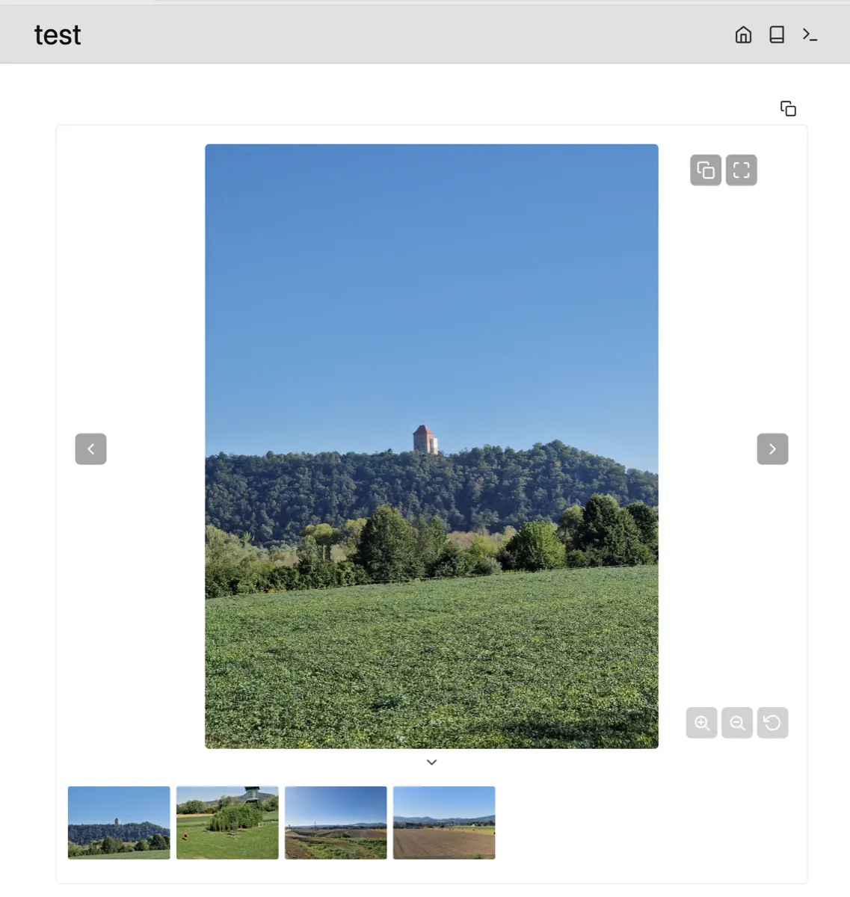

# silverbullet-media-slider



A [SilverBullet](https://silverbullet.md) plug that renders an interactive media
slider / carousel inside fenced `media-slider` code blocks. Inspired by the
Obsidian [Media Slider](https://github.com/amatya-aditya/obsidian-media-slider)
plugin.

## Features

- **Mixed media** — images, video, audio, PDF, YouTube embeds, and markdown-file slides
- **Thumbnails** — position top / bottom / left / right; collapsible with a toggle button
- **Captions** — overlay or below the media
- **Transitions** — fade, slide, zoom, slide-up, slide-down, flip, flip-vertical, rotate, blur, squeeze
- **Autoplay** — configurable slideshow speed
- **Navigation** — keyboard (arrow keys), touch swipe, and prev/next buttons
- **Zoom & pan** — click to zoom, drag to pan, +/-/reset buttons, Ctrl+scroll to zoom (images only)
- **Fullscreen** — iframe-aware fullscreen that pins the host element
- **Copy link** — copy the markdown wikilink for the current slide
- **Folder expansion** — include all media from a folder, optionally recursive

## Usage

In any page, create a fenced `media-slider` code block:

````markdown
```media-slider
---
carouselShowThumbnails: true
thumbnailPosition: bottom
transitionEffect: fade
transitionDuration: 300
enhancedView: true
---
![[photo1.jpg|A sunrise]]
![[photo2.png|A calm lake]]
![[clip.mp4]]
![[song.mp3]]
![[doc.pdf]]
```
````

### Linking media

| Syntax | Description |
|--------|-------------|
| `![[path/to/file.png]]` | Wikilink (resolved against your space) |
| `![[file.png\|Caption text]]` | Wikilink with caption |
| `` | Markdown image syntax |
| `https://youtube.com/watch?v=...` | YouTube URL → embedded player |
| `https://example.com/file.mp4` | Remote URL (kind inferred from extension) |

### Folder expansion

Include all media from a folder in one block:

````markdown
```media-slider
---
fileTypes:
  - jpg
  - png
  - mp4
recursive: true
---
[[folder/subfolder/]]
```
````

> **Note:** Folder expansion uses `space.listFiles()` to enumerate files. Files
> under `_/` (system prefix) may not appear if they aren't indexed by
> SilverBullet. If files aren't found, try moving them to a non-`_/` path.

### Markdown slides

A `.md` page referenced in the slider is rendered inline as a slide (read-only).

## YAML options

| Option | Type | Default | Description |
|--------|------|---------|-------------|
| `sliderId` | string | auto | Stable id for the slider instance |
| `carouselShowThumbnails` | bool | `true` | Show the thumbnail strip |
| `thumbnailPosition` | string | `bottom` | `top` / `bottom` / `left` / `right` |
| `captionMode` | string | `overlay` | `overlay` or `below` |
| `autoplay` | bool | `false` | Autoplay videos |
| `slideshowSpeed` | number | `0` | Seconds between slides; `0` disables |
| `width` | string | `100%` | CSS width |
| `height` | string | `380px` | CSS height |
| `transitionEffect` | string | `fade` | See list below |
| `transitionDuration` | number | `300` | Transition duration in milliseconds |
| `enhancedView` | bool | `true` | Show fullscreen + copy buttons; enable zoom/pan |
| `fileTypes` | list | all media | Extensions to include for folder expansion |
| `recursive` | bool | `false` | Recurse into subfolders during folder expansion |
| `showThumbnailToggle` | bool | `true` | Show collapse/expand button on thumbnail strip |
| `thumbnailsCollapsedByDefault` | bool | `false` | Start with thumbnails collapsed |

**Transition effects:** `fade`, `slide`, `zoom`, `slide-up`, `slide-down`,
`flip`, `flip-vertical`, `rotate`, `blur`, `squeeze`.

## Install

Use the `Library: Install` command in SilverBullet with this URL:

```
https://github.com/glechic/silverbullet-media-slider/blob/main/PLUG.md
```

## Build

```sh
npm install
npm run build
```

Produces `build/media-slider.plug.js` via `plug-compile`.

## License

MIT